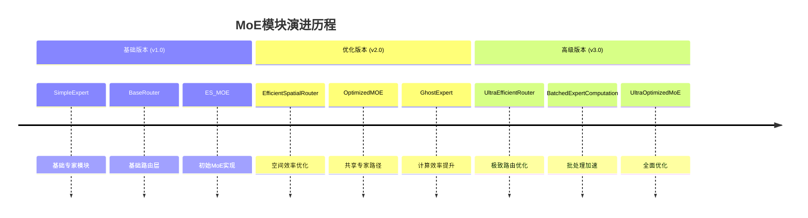

# YOLO-Master MoE 模块详解与演进

本文档旨在深入解析 `ultralytics/nn/modules/moe.py` 文件中的 Mixture-of-Experts (MoE) 模块。我们将分析各个类的设计意图、优缺点、区别，技术演进路线，以及针对不同硬件的部署指南。

## 1. 核心 MoE 模块概览

代码库中包含了几代 MoE 的实现，反映了从基础探索到高性能优化的过程。

### 1.1 ES_MOE (Early Stage / Efficient Sparse MoE)
这是最早期的 MoE 实现，主要用于概念验证。

- **特点**：
  - **异构专家**：默认使用不同大小的卷积核（3x3, 5x5, 7x7...）作为专家，试图捕捉不同尺度的特征。
  - **基础路由**：使用 `DynamicRoutingLayer`，基于全局平均池化。
  - **训练模式**：默认采用 **Dense Forward**（计算所有专家并加权），虽然保留了梯度但效率极低。
  - **无共享专家**：缺乏共享路径，训练初期容易不稳定。

- **优点**：结构直观，异构卷积核的概念在某些特定场景可能有优势。
- **缺点**：训练速度慢，显存占用高，缺乏稳定性机制（容易出现路由坍缩）。

### 1.2 OptimizedMOE
针对 `ES_MOE` 的痛点进行的第一次重大改进。

- **特点**：
  - **引入 Shared Expert (共享专家)**：增加了一个始终激活的并行分支。这是现代 MoE 的标配，保证了模型的保底性能，显著提升训练稳定性。
  - **高效空间路由**：使用 `EfficientSpatialRouter`，引入预池化（Pre-pooling）减少路由计算量。
  - **同构专家**：通常使用相同的 `SimpleExpert`，便于并行优化。

- **优点**：训练更稳定，计算效率更高。
- **缺点**：模块的可配置性相对较低。

### 1.3 OptimizedMOEImproved (别名: ModularRouterExpertMoE)
**当前推荐使用的版本**。这是一个高度模块化、成熟的工业级实现。

- **特点**：
  - **高度模块化**：支持插拔式配置 Router（Efficient, Local, Adaptive）和 Expert（Simple, Ghost, Inverted）。
  - **稳定性增强**：引入 **Z-Loss**，防止 Router 输出的 Logits 数值爆炸，进一步稳定训练。
  - **标准化的辅助损失**：整合了负载均衡损失（Load Balancing Loss）和 Z-Loss。
  - **初始化策略**：对 Router 进行了专门的初始化（高斯分布 std=0.01），防止初期“赢家通吃”。

- **优点**：灵活性高，稳定性好，适合生产环境和科研实验。
- **缺点**：相比极致优化的版本，推理速度仍有提升空间。

### 1.4 UltraOptimizedMoE
代表了极致性能优化的方向，**专为高性能部署设计**。

- **特点**：
  - **UltraEfficientRouter**：使用深度可分离卷积 + 激进的降采样（8x/16x），路由计算量减少 ~95%。
  - **Batched Expert Computation**：通过 `BatchedExpertComputation` 类实现专家的**批量并行计算**，消除了 Python `for` 循环，推理速度提升 3-5 倍。
  - **GroupNorm**：替代 BatchNorm，在小批量（Micro-batch）训练时更稳定。
  - **条件计算**：支持设置权重阈值，跳过贡献极小的专家计算。

- **优点**：推理速度极快，FLOPs 最低，显存占用最少。
- **缺点**：实现复杂度最高，代码理解难度大。

---

## 2. 路由模块 (Routers) 对比

路由器的核心任务是为每个输入样本（或 Token）分配专家。

| 模块名称 | 特点 | 适用场景 |
| :--- | :--- | :--- |
| **DynamicRoutingLayer** | 基础实现，支持 Soft/Hard Top-K。 | `ES_MOE` 专用，不推荐新模型使用。 |
| **EfficientSpatialRouter** | **先降采样再路由**。通过 AvgPool 减小特征图尺寸，大幅降低 FLOPs。 | 通用场景，平衡了精度与速度。 |
| **LocalRoutingLayer** | 降采样倍率较小，保留更多局部纹理信息。 | 对小目标检测要求高的场景。 |
| **AdaptiveRoutingLayer** | 使用自适应池化到 1x1，忽略空间信息，仅利用通道信息。 | 计算资源极度受限的场景。 |
| **UltraEfficientRouter** | 深度可分离卷积 + 激进降采样 + 温度系数控制。 | 追求极致速度的边缘设备部署。 |

---

## 3. 专家模块 (Experts) 对比

专家网络负责处理被分配到的数据。

| 模块名称 | 结构 | 优点 | 缺点 |
| :--- | :--- | :--- | :--- |
| **SimpleExpert** | Conv-BN-SiLU-Conv-BN | 标准结构，易于优化。 | 参数量标准。 |
| **GhostExpert** / **FusedGhostExpert** | 基于 GhostNet 思想，用廉价操作生成特征图。 | **参数量和 FLOPs 减半**。 | 特征表达能力可能略有下降。 |
| **InvertedResidualExpert** | MobileNetV2 的倒残差结构。 | 适合移动端部署。 | 深度较深，延迟可能增加。 |
| **OptimizedSimpleExpert** | 使用 **GroupNorm** 替代 BatchNorm。 | **小 Batch 训练稳定**。 | 推理时无法像 BN 那样完美融合进 Conv。 |

---

## 4. 技术演进总结



从代码演进的脉络可以看出明显的优化方向：

1.  **从异构到同构**：`ES_MOE` 尝试用不同卷积核，但后续版本回归同构专家，更利于硬件并行。
2.  **稳定性优先**：从 `OptimizedMOE` 开始引入 **Shared Expert**，这是解决 MoE 训练不稳定的关键一招。
3.  **计算效率**：从 `Dense Forward` (训练所有专家) 转向 `Sparse Forward` (仅计算 Top-K)，并在 `Ultra` 版本中实现了**Batch并行化**。
4.  **数值稳定性**：引入 Z-Loss 和特定的初始化策略，解决 Router 的梯度问题。

---

## 5. 硬件部署与推理优化指南

**误区澄清**：许多人认为 MoE 包含动态控制流（If/Else），因此难以部署或无法使用 TensorRT/NPU。事实上，YOLO-Master 的 MoE 模块经过特殊设计，完全可以进行高效部署。

### 5.1 NVIDIA GPU (Server/Desktop)
在 GPU 上，MoE 的主要挑战是“小 Kernel 启动开销”和“线程束分歧（Warp Divergence）”。

*   **推荐模块**：`UltraOptimizedMoE`
*   **优化原理**：
    *   该模块实现了 **Batched Computation**（批量计算）。它不使用 Python 循环遍历专家，而是通过 `torch.where` 和 `index_add_` 等算子，将分配给同一专家的样本聚合，一次性发射 CUDA Kernel。
    *   这大大减少了 Kernel 启动次数，显著提升了 GPU 利用率。
*   **TensorRT 部署**：
    *   YOLO-Master 的路由逻辑仅依赖 `TopK`, `Gather`, `Scatter` (或 `IndexAdd`) 等标准算子。
    *   现代 TensorRT (8.x+) 对这些算子支持良好。
    *   **提示**：导出 ONNX 时，确保使用 Opset >= 11（推荐 13+）。

### 5.2 CPU (Intel/AMD)
CPU 是运行 MoE 的理想平台之一，因为 CPU 拥有强大的分支预测能力，处理稀疏计算非常高效。

*   **性能优势**：
    *   MoE 的稀疏性（例如 4 个专家只选 2 个）意味着 CPU 实际上跳过了 50% 的浮点运算。
    *   相比 GPU，CPU 不受 Warp Divergence 的惩罚，`If/Else` 分支对其影响较小。
*   **部署建议**：
    *   使用 OpenVINO 或 ONNX Runtime。
    *   确保开启 `use_sparse_inference=True`，CPU 将实打实地获得 FLOPs 减少带来的加速。

### 5.3 移动端与边缘设备 (NPU/DSP)
NPU（如高通 Hexagon, 瑞芯微 NPU）通常对动态控制流支持较弱，偏好静态图。

*   **挑战**：动态路由可能导致 NPU 无法流水线化，回退到 CPU 执行。
*   **解决方案 A：GhostExpert (推荐)**
    *   在移动端，内存带宽通常是瓶颈。配置 `expert_type='ghost'` 可以将参数量和访存量减半，极大缓解带宽压力。
*   **解决方案 B：静态图导出 (Static Graph Export)**
    *   如果目标 NPU 不支持 `Gather`/`Scatter`，可以在导出时修改代码，将 `top_k` 设置为等于 `num_experts`。
    *   虽然这变成了 Dense 模式（计算量增加），但它将 MoE 转换为了标准的并行卷积结构，所有 NPU 都能完美兼容并加速。
*   **解决方案 C：Shared Expert Only**
    *   在极低算力设备上，可以仅推理 `Shared Expert` 分支（如果训练时采用了特定策略），作为一种动态的“降级”运行模式。

### 5.4 导出建议 (Export Tips)

为了确保顺利导出到 ONNX/TensorRT，请遵循以下建议：

1.  **Opset Version**：导出时设置 `opset_version=13` 或更高。
    ```python
    torch.onnx.export(model, input, "model.onnx", opset_version=13, ...)
    ```
2.  **动态轴 (Dynamic Axes)**：MoE 内部涉及 Reshape 操作，建议固定 Batch Size 导出以获得最佳性能优化，除非确实需要动态 Batch。
3.  **验证一致性**：MoE 的数值计算顺序可能因并行度不同而微小变化，导出后请验证 `atol=1e-4` 级别的精度对齐。

---

## 6. 配置指南与常见问题 (FAQ)

### 6.1 YAML 配置示例

在 `yolo-master.yaml` 中，您可以按如下方式配置 MoE 模块：

```yaml
# [out_channels, num_experts, reduction, top_k]
# 示例 1: 标准配置 (推荐)
- [-1, 1, ModularRouterExpertMoE, [512, 4, 2]]  # 4个专家选2个，输出512通道

# 示例 2: 追求速度 (Ghost专家)
- [-1, 1, UltraOptimizedMoE, [512, 4, 2, 'ghost']] 

# 示例 3: 极致精度 (8专家)
- [-1, 1, ModularRouterExpertMoE, [512, 8, 2]] 
```

### 6.2 常见问题解决

**Q1: 训练初期 Loss 震荡或 NaN？**
- **原因**：路由网络初始化不当导致某些专家从未被选中（Dead Expert），数值溢出。
- **解决**：确保使用 `OptimizedMOEImproved` 或更新版本，它们内置了 `Shared Expert` 和 `Z-Loss`，且初始化时使用了 `std=0.01`。
- **应急**：尝试降低学习率，或增加 `warmup_epochs`。

**Q2: 导出 ONNX 报错 "Gather/Scatter not supported"？**
- **原因**：Opset 版本过低。
- **解决**：设置 `opset_version=13` 或更高。对于非常老的推理引擎，请参考上文 "5.3 解决方案 B"。

**Q3: 为什么显存占用比普通 YOLO 高？**
- **原因**：虽然推理是稀疏的（只计算 Top-K），但模型参数量（Parameters）是实打实增加了（N个专家）。
- **解决**：减少 `num_experts`（如从 8 改为 4），或使用 `GhostExpert`。训练时可以使用混合精度（AMP）来缓解。
