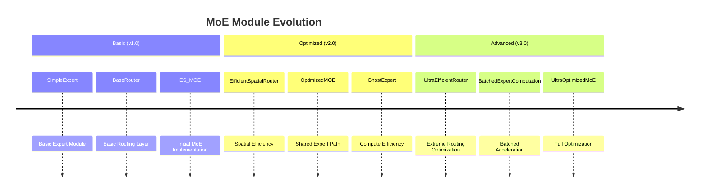

# YOLO-Master MoE Modules: Deep Dive & Evolution

This document aims to provide an in-depth analysis of the Mixture-of-Experts (MoE) modules in `ultralytics/nn/modules/moe.py`. We will analyze the design intent, pros and cons, differences, technical evolution, and deployment guides for various hardware.

## 1. Core MoE Modules Overview

The codebase contains several generations of MoE implementations, reflecting the process from basic exploration to high-performance optimization.

### 1.1 ES_MOE (Early Stage / Efficient Sparse MoE)
This is the earliest MoE implementation, primarily used for proof of concept.

- **Features**:
  - **Heterogeneous Experts**: Defaults to using different kernel sizes (3x3, 5x5, 7x7...) as experts, attempting to capture features at different scales.
  - **Basic Routing**: Uses `DynamicRoutingLayer`, based on global average pooling.
  - **Training Mode**: Defaults to **Dense Forward** (computes all experts and weights them), which retains gradients but is very inefficient.
  - **No Shared Expert**: Lacks a shared path, making training unstable in the early stages.

- **Pros**: Intuitive structure; heterogeneous kernels might have advantages in specific scenarios.
- **Cons**: Slow training, high memory usage, lacks stability mechanisms (prone to routing collapse).

### 1.2 OptimizedMOE
The first major improvement addressing the pain points of `ES_MOE`.

- **Features**:
  - **Introduced Shared Expert**: Adds a parallel branch that is always active. This is a standard in modern MoE, ensuring a baseline performance and significantly improving training stability.
  - **Efficient Spatial Routing**: Uses `EfficientSpatialRouter`, introducing Pre-pooling to reduce routing computation.
  - **Homogeneous Experts**: Usually uses the same `SimpleExpert`, facilitating parallel optimization.

- **Pros**: More stable training, higher computational efficiency.
- **Cons**: Relatively low configurability.

### 1.3 OptimizedMOEImproved (Alias: ModularRouterExpertMoE)
**Currently Recommended Version**. This is a highly modular, mature, industrial-grade implementation.

- **Features**:
  - **Highly Modular**: Supports pluggable Router (Efficient, Local, Adaptive) and Expert (Simple, Ghost, Inverted) configurations.
  - **Stability Enhancement**: Introduces **Z-Loss** to prevent logit explosion from the Router, further stabilizing training.
  - **Standardized Auxiliary Loss**: Integrates Load Balancing Loss and Z-Loss.
  - **Initialization Strategy**: Specialized initialization for the Router (Gaussian dist std=0.01) to prevent "winner-takes-all" in early stages.

- **Pros**: High flexibility, good stability, suitable for production and research.
- **Cons**: Inference speed still has room for improvement compared to the ultra-optimized version.

### 1.4 UltraOptimizedMoE
Represents the direction of extreme performance optimization, **designed for high-performance deployment**.

- **Features**:
  - **UltraEfficientRouter**: Uses Depthwise Separable Conv + Aggressive Downsampling (8x/16x), reducing routing FLOPs by ~95%.
  - **Batched Expert Computation**: Implements **Batched Parallel Computation** via `BatchedExpertComputation`, eliminating Python `for` loops, boosting inference speed by 3-5x.
  - **GroupNorm**: Replaces BatchNorm, more stable during micro-batch training.
  - **Conditional Computation**: Supports setting weight thresholds to skip experts with minimal contribution.

- **Pros**: Extremely fast inference, lowest FLOPs, minimal memory usage.
- **Cons**: Highest implementation complexity, harder to understand code.

---

## 2. Router Modules Comparison

The core task of the router is to assign experts to each input sample (or Token).

| Module Name | Features | Usage Scenario |
| :--- | :--- | :--- |
| **DynamicRoutingLayer** | Basic implementation, supports Soft/Hard Top-K. | Specific to `ES_MOE`, not recommended for new models. |
| **EfficientSpatialRouter** | **Downsample then Route**. Reduces feature map size via AvgPool, drastically lowering FLOPs. | General scenarios, balancing accuracy and speed. |
| **LocalRoutingLayer** | Smaller downsampling ratio, preserving more local texture information. | Scenarios with high requirements for small object detection. |
| **AdaptiveRoutingLayer** | Adaptive pooling to 1x1, ignoring spatial info, using only channel info. | Scenarios with extremely limited computational resources. |
| **UltraEfficientRouter** | Depthwise Separable Conv + Aggressive Downsampling + Temperature Control. | Edge device deployment pursuing extreme speed. |

---

## 3. Expert Modules Comparison

Expert networks are responsible for processing the assigned data.

| Module Name | Structure | Pros | Cons |
| :--- | :--- | :--- | :--- |
| **SimpleExpert** | Conv-BN-SiLU-Conv-BN | Standard structure, easy to optimize. | Standard parameter count. |
| **GhostExpert** / **FusedGhostExpert** | Based on GhostNet, generates feature maps with cheap operations. | **Halves Parameters and FLOPs**. | Feature expression capability might slightly degrade. |
| **InvertedResidualExpert** | MobileNetV2 Inverted Residual structure. | Suitable for mobile deployment. | Deeper depth, potential latency increase. |
| **OptimizedSimpleExpert** | Uses **GroupNorm** instead of BatchNorm. | **Stable for small Batch training**. | Cannot fuse into Conv perfectly during inference like BN. |

---

## 4. Technical Evolution Summary



The code evolution shows clear optimization directions:

1.  **Heterogeneous to Homogeneous**: `ES_MOE` tried different kernels, but later versions reverted to homogeneous experts for better hardware parallelism.
2.  **Stability First**: Introduced **Shared Expert** starting from `OptimizedMOE`, a key move to solve MoE training instability.
3.  **Compute Efficiency**: Shifted from `Dense Forward` (training all experts) to `Sparse Forward` (Top-K only), and implemented **Batch Parallelism** in the `Ultra` version.
4.  **Numerical Stability**: Introduced Z-Loss and specific initialization strategies to solve Router gradient issues.

---

## 5. Hardware Deployment & Inference Optimization Guide

**Clarification**: Many believe MoE contains dynamic control flow (If/Else) and is hard to deploy or use with TensorRT/NPU. In fact, YOLO-Master's MoE modules are specially designed for efficient deployment.

### 5.1 NVIDIA GPU (Server/Desktop)
On GPUs, the main challenges for MoE are "Small Kernel Launch Overhead" and "Warp Divergence".

*   **Recommended Module**: `UltraOptimizedMoE`
*   **Optimization Principle**:
    *   Implements **Batched Computation**. Instead of Python loops iterating over experts, it aggregates samples assigned to the same expert using operators like `torch.where` and `index_add_`, launching CUDA Kernels at once.
    *   This significantly reduces Kernel launch counts and improves GPU utilization.
*   **TensorRT Deployment**:
    *   YOLO-Master's routing logic relies only on standard operators like `TopK`, `Gather`, `Scatter` (or `IndexAdd`).
    *   Modern TensorRT (8.x+) supports these operators well.
    *   **Tip**: Use Opset >= 11 (Recommended 13+) when exporting ONNX.

### 5.2 CPU (Intel/AMD)
CPU is an ideal platform for running MoE because CPUs have strong branch prediction capabilities, handling sparse computation very efficiently.

*   **Performance Advantage**:
    *   MoE's sparsity (e.g., selecting 2 out of 4 experts) means the CPU actually skips 50% of FLOPs.
    *   Unlike GPUs, CPUs suffer less from Warp Divergence penalties; `If/Else` branches have less impact.
*   **Deployment Advice**:
    *   Use OpenVINO or ONNX Runtime.
    *   Ensure `use_sparse_inference=True` is enabled to gain real speedup from FLOPs reduction.

### 5.3 Mobile & Edge Devices (NPU/DSP)
NPUs (e.g., Qualcomm Hexagon, Rockchip NPU) often have weak support for dynamic control flow and prefer static graphs.

*   **Challenge**: Dynamic routing may prevent NPU pipelining, falling back to CPU execution.
*   **Solution A: GhostExpert (Recommended)**
    *   Memory bandwidth is often the bottleneck on mobile. Configuring `expert_type='ghost'` halves parameters and memory access, greatly relieving bandwidth pressure.
*   **Solution B: Static Graph Export**
    *   If the target NPU doesn't support `Gather`/`Scatter`, modify the code during export to set `top_k` equal to `num_experts`.
    *   Although this becomes Dense mode (increased computation), it converts MoE into a standard parallel convolution structure, compatible with all NPUs for acceleration.
*   **Solution C: Shared Expert Only**
    *   On extremely low-power devices, you can infer only the `Shared Expert` branch (if a specific strategy was used during training) as a dynamic "degraded" running mode.

### 5.4 Export Tips

To ensure smooth export to ONNX/TensorRT, follow these suggestions:

1.  **Opset Version**: Set `opset_version=13` or higher.
    ```python
    torch.onnx.export(model, input, "model.onnx", opset_version=13, ...)
    ```
2.  **Dynamic Axes**: MoE involves Reshape operations. It is recommended to fix Batch Size during export for best performance optimization, unless dynamic Batch is strictly required.
3.  **Verify Consistency**: MoE's numerical computation order might vary slightly due to parallelism. Verify alignment with `atol=1e-4` after export.

---

## 6. Configuration Guide & FAQ

### 6.1 YAML Configuration Examples

In `yolo-master.yaml`, you can configure MoE modules as follows:

```yaml
# [out_channels, num_experts, reduction, top_k]
# Example 1: Standard Configuration (Recommended)
- [-1, 1, ModularRouterExpertMoE, [512, 4, 2]]  # 4 experts, select 2, output 512 channels

# Example 2: Speed Oriented (Ghost Experts)
- [-1, 1, UltraOptimizedMoE, [512, 4, 2, 'ghost']] 

# Example 3: Extreme Precision (8 Experts)
- [-1, 1, ModularRouterExpertMoE, [512, 8, 2]] 
```

### 6.2 FAQ

**Q1: Loss oscillation or NaN during early training?**
- **Cause**: Improper router initialization leads to some experts never being selected (Dead Expert) or numerical overflow.
- **Solution**: Ensure using `OptimizedMOEImproved` or newer versions, which have built-in `Shared Expert` and `Z-Loss`, and use `std=0.01` for initialization.
- **Emergency**: Try lowering learning rate or increasing `warmup_epochs`.

**Q2: ONNX export error "Gather/Scatter not supported"?**
- **Cause**: Opset version too low.
- **Solution**: Set `opset_version=13` or higher. For very old inference engines, refer to "Solution B" in section 5.3.

**Q3: Why is VRAM usage higher than normal YOLO?**
- **Cause**: Although inference is sparse (only Top-K computed), model parameters are physically increased (N experts).
- **Solution**: Reduce `num_experts` (e.g., from 8 to 4) or use `GhostExpert`. Use Mixed Precision (AMP) during training to mitigate.
